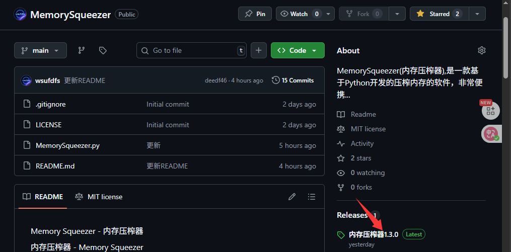

Memory Squeezer - 内存压榨器

 简介

Memory Squeezer 是一个用于测试系统在内存压力下的表现，使用deepseek R1编写。

## 功能特性

- ✅ 单线程和多进程内存压榨模式
- ✅ 可配置的内存块大小和分配速度
- ✅ 实时内存状态监控
- ✅ 四重安全确认机制防止误操作
- ✅ 内存安全限制保护
- ✅ 详细的日志记录
- ✅ 支持多种主题风格

## 系统要求

- windows10 +
- 建议内存大小4GB+(避免因为内存过小，程序写入速度过快导致系统问题！)

## 安装

### 第一种
1.从Releases下载最新版本的程序

2.双击程序
### 第二种
1. 克隆仓库或下载源代码
```bash
git clone https://github.com/wsufdfs/memory-squeezer.git
```

```bash
cd memory-squeezer
```
2. 安装依赖
```bash
pip install PyQt5 psutil
```

## 使用方法

### 基本使用

1. 运行程序
```bash
python memory_squeezer.py
```

2. 点击"开始压榨"按钮启动内存压榨

3. 观察内存使用情况和进度

4. 使用"安全停止"或"紧急停止"结束压榨

### 配置选项

程序会自动创建 `config.ini` 配置文件，您可以修改以下参数：

```ini
[Settings]
BlockSize=10           ; 内存块大小(MB)
AllocationsPerSecond=500 ; 每秒分配次数
ReservePercent=2        ; 保留内存百分比
MemoryLimit=256         ; 内存安全限制(MB)
VirtualMemoryLimit=1024  ;虚拟内存安全限制（MB）
UseMultiprocessing=false ; 是否使用多进程
WorkerProcesses=4       ; 工作进程数
SqueezeVirtualMemory=false ;是否压榨虚拟内存（默认false）


[Window]
Width=600              ; 窗口宽度
Height=500             ; 窗口高度

[Theme]
Theme=Light            ; 主题风格
ProgressBarColor=0,128,255 ; 进度条颜色(RGB)

[Logging]
LogFile=memory_squeezer.log ; 日志文件路径
LogLevel=INFO           ; 日志级别
```

## 注意事项

⚠️ **重要警告**  
此程序会消耗大量系统内存，可能导致系统不稳定！使用时请确保：

1. 已保存所有工作
2. 了解操作风险
3. 系统有足够的内存资源

## 开发计划

- [ ] 添加更多可视化图表
- [ ] 支持自定义内存分配模式
- [ ] 增加压力测试报告功能
- [ ] 支持多语言界面
- [ ] 添加程序主界面直接修改配置

## 贡献指南

欢迎提交 Issue 或 Pull Request 来改进本项目。

## 联系我们

程序作者QQ：640384548

官方QQ群：925707447